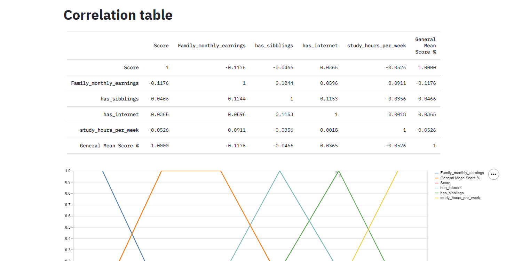

# EdTech_TestRecomender


## Table of Contents
1. [Project Motivation](#Motivation)
2. [Files Structure](#files_structure)
3. [Getting Started](#getting_started)
	1. [Dependencies](#dependencies)
	2. [Installing](#installing)
	3. [Executing Program](#executing)
4. [Authors & Licensing](#authors)
5. [Acknowledgement](#acknowledgement)
6. [Screenshots](#screenshots)

<a name="Motivation"></a>
## Motivation

One of the many difficult parts of small education organizations it's having people power to do all the work. So, I designed a system for automating the correction process of mock tests, with the features of grades visualization in many aspects and a the possibility to the teacher atach recomended actions based on the student's performance.
So, besides getting the job of correcting the tests done, the teacher also has a powerfull visualization tool, and a performance improvement for the student.

The Project is divided in the following Sections:

1. Data Processing, ETL Pipeline to extract data from source, clean data and save them in a proper structure
2. Web App to show reports and make recomendations. 

<a name="files_structure"></a>
## Files Structure input (all the files data, were fabricated by me)
1. Data
* Answers.csv
* Student_Answwers.csv  
* Students_info.csv
* Subjects.csv
Note: All the files should follow the same structure as the ones in this project

Make yourself confortable foi inputing your own students data


<a name="getting_started"></a>
## Getting Started

<a name="dependencies"></a>
### Dependencies
* Python 3.5+ (I used Python 3.7)
* Data Science Libraries: NumPy, Pandas
* Standart libraries: datetime
* Web App: Streamlit

<a name="installing"></a>
### Installing
Clone this GIT repository:
```
git clone https://github.com/gabrielboehme/EdTech_TestRecomender.git
```
<a name="executing"></a>
### Executing Program:
1. Run the following commands in the project's root directory to set up your data.

    - To run ETL pipeline that cleans data and stores in other format:
        `python Transform_Data.py`

2. Run the following command in the app's directory to run your web app.
         
        `streamlit run app.py`

3. Go to http://localhost:8501/

<a name="Author"></a>
## Authors

* [Gabriel Boehme](https://github.com/gabrielboehme/)

<a name="acknowledgement "></a>
## Acknowledgements

* [Udacity](https://www.udacity.com/) for providing such a complete Data Science Nanodegree Program

<a name="screenshots"></a>
## Screenshots

1. General report


2. Students Report


3. Students info





4. Recomendations


